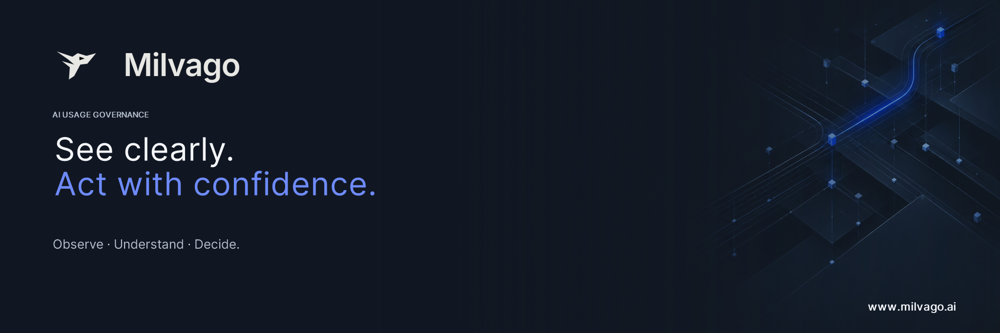

<p align="center">
  
</p>

<h3 align="center">See the AI your organization actually uses.</h3>

<p align="center">
  Open source Shadow AI governance, from the browser where it happens.<br>
  Discover every AI platform your people reach, see what leaves the machine, and mask it before it does.
</p>

<p align="center">
  <a href="LICENSE"></a>
  
  
  
  
  <a href="https://discord.gg/69JPyVjqv"></a>
</p>

---

## Why Milvago

Your people already use generative AI. Some of it is sanctioned; most of it is a browser tab
nobody inventoried. A policy nobody can observe is a wish, and blocking everything only moves
the problem to personal devices.

Milvago gives you the missing layer: **an accurate inventory of AI usage, and control at the
point where data actually leaves**, without reading more than you need and without turning
your security team into a surveillance desk.

## What you get

### Discover

- **169 known AI platforms detected by presence.** The browser endpoint reports that a host
  was reached, and nothing of the page. You find out which assistants are in use before
  deciding anything.
- **Mute what you officially use.** Hide sanctioned platforms from Discovery without touching
  detection: visits keep being recorded, the noise goes away.

### Understand

- **Conversations on ChatGPT and Claude**: prompts, responses, and which model answered.
- **Cartography**: a flow diagram of who uses which tool, on which provider, with which model.
- **Reports**: aggregated views, CSV and JSON export, and a printable synthesis for the
  steering committee.

### Protect

- **Mask before it leaves.** Custom masking rules (RE2, up to 25 per organization) replace
  sensitive values in the prompt itself with readable markers such as `[IP]`, or `[IP1]` and
  `[IP2]` when there are several.
- **Block file uploads** to covered assistants, on the upload routes measured on each site,
  never on a guess.

### Built for privacy

- Content, device names and identities **encrypted at rest**.
- **Pseudonymous by default**: people appear as aliases. Revealing an identity takes a
  dedicated permission, a fresh second factor and a written reason; it is audited and expires
  after 15 minutes.
- Content retention from **1 to 30 days**, owner-only purge behind a fresh second factor, and
  an **aggregate-only** mode that keeps counts and drops the rest.

### Secure by default

- Sign-in through **OpenID Connect** (Keycloak included), **TOTP** second factor.
- **Role-based access** with four built-in roles (owner, admin, viewer, reporter) and a full
  **audit log**.
- **REST API** with scoped keys (`mvk_…`): a key never exceeds its creator's *current* rights.
- A one-time **setup token** opens the first-run wizard, then closes it for good. HTTPS is
  required beyond localhost.
- Shipped as a **distroless, non-root** container: no shell, no package manager.

## How it works

```
  Browser + Milvago extension          Milvago server (Go)              Console (React)
 ┌──────────────────────────┐   HTTPS  ┌──────────────────────┐        ┌─────────────────┐
 │ presence · capture ·     │ ───────► │ policy · ingestion · │ ◄───── │ discovery · map │
 │ masking · upload guard   │ ◄─────── │ signed catalogue     │        │ reports · admin │
 └──────────────────────────┘  policy  └──────────┬───────────┘        └─────────────────┘
                                                  │
                                    PostgreSQL ◄──┴──► Keycloak (OIDC)
```

The server signs the detection catalogue and the policy it hands to endpoints; endpoints
enforce it locally, so masking happens **before** the request reaches the AI provider.

This repository holds the **server and the console**. The endpoint agent and its browser
extension are distributed separately.

## Quick start

The localhost default described below is in development and is not included in the published 1.0.1 installer.

On a Linux server with Bash, curl, Internet access and root or sudo privileges, run:

```bash
curl -fsSL https://get.milvago.ai | bash
```

For shared access, enter your full public Milvago URL, such as `https://milvago.example.com`, at the `Milvago public URL [http://localhost:4020]:` prompt.
Prepare DNS and an HTTPS reverse proxy to the server's private IP on port **4020** first.
No GitHub account or token is required. The installer checks prerequisites and installs
the public release using its exact image version and digest.

Press Enter at the prompt for local access at `http://localhost:4020`; the gateway then binds only to
`127.0.0.1:4020`. An explicit `http://localhost:4020`, `http://127.0.0.1:4020`, or an empty
`MILVAGO_PUBLIC_URL` selects the same local mode. From another computer, tunnel it with
`ssh -L 4020:127.0.0.1:4020 user@server`, then open `http://localhost:4020` locally. Local mode
opens no additional host ports; the application and identity service remain internal.

To provide the URL directly:

```bash
curl -fsSL https://get.milvago.ai | MILVAGO_PUBLIC_URL=https://milvago.example.com bash
```

For non-interactive local access:

```bash
curl -fsSL https://get.milvago.ai | MILVAGO_PUBLIC_URL='' bash
```

Open the displayed URL and enter `MILVAGO_SETUP_TOKEN` from the `.env` file at the
path printed by the installer. Complete the wizard to create the administrator.
Configure and test a real SMTP server for invitations and password-reset email;
Mailpit is disabled by default. See [INSTALL.md](INSTALL.md) for prerequisites,
checksum verification, upgrades and building from source.

## Community and Enterprise

Community is free, open source and complete for a single organization. Without a licence it
runs with 5 devices and a single owner; a **free Community licence**, requested from the setup
wizard, lifts those limits and unlocks custom roles, member invitations, SSO and LDAP.

| | Community | Enterprise |
|---|---|---|
| Organizations | One | Many, isolated by PostgreSQL row-level security |
| Endpoints | Browser | Browser and native AI tools (Claude Code, Codex, Claude Desktop) |
| Conversation capture | ChatGPT, Claude | Nine providers |
| Presence detection | 169 platforms | 169 platforms |
| Masking | Custom rules | Custom rules and built-in sensitive-data patterns |
| Model control and usage sensitivity | — | ✓ |
| MCP server, observability export (OTLP) | — | ✓ |
| License | AGPL-3.0-only | Commercial |

Enterprise is available from Milvago AI, LLC — [www.milvago.ai](https://www.milvago.ai).

## Repository layout

| Path | What it is |
|---|---|
| `server/` | Go backend, migrations, signed detection catalogue |
| `console/` | React console (Vite, TypeScript), four languages |
| `deploy/` | Container build, PostgreSQL initialization, identity theme |

Run the suites with `cd console && npm ci && npm test` and `cd server && go test ./...`.
`docker compose build` runs both inside the build: an image is never produced from a red tree.

## Community

Questions, ideas, setups to share: join the **[Milvago AI Discord](https://discord.gg/69JPyVjqv)**.
Bugs and feature requests go to [GitHub issues](https://github.com/Milvago-AI/milvago-server/issues);
[SUPPORT.md](SUPPORT.md) says which channel fits what. Everyone taking part follows the
[Code of Conduct](CODE_OF_CONDUCT.md).

## Security

Found a vulnerability? Please do not open a public issue — see [SECURITY.md](SECURITY.md).

## Contributing

Contributions are welcome. Read [CONTRIBUTING.md](CONTRIBUTING.md) first, and see
[CHANGELOG.md](CHANGELOG.md) for what changed between releases.

## License

Copyright © 2026 Milvago AI, LLC. The server and the console are licensed under
[AGPL-3.0-only](LICENSE); see [LICENSING.md](LICENSING.md) for what that means for
operators, and [THIRD-PARTY.md](THIRD-PARTY.md) for dependencies. "Milvago" and the Milvago
logo are trademarks of Milvago AI, LLC.
